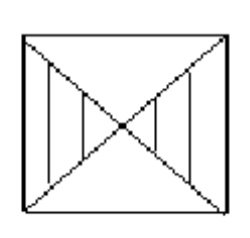

# Lab 8

### Завдання 
Для введеної квадратоної матриці А розмірності n одержати значення на перетині головної та побічної діагоналей. Сформувати нову матирицю B(n x n), помінявши місцями затушовані частини матриці A

### Результат
